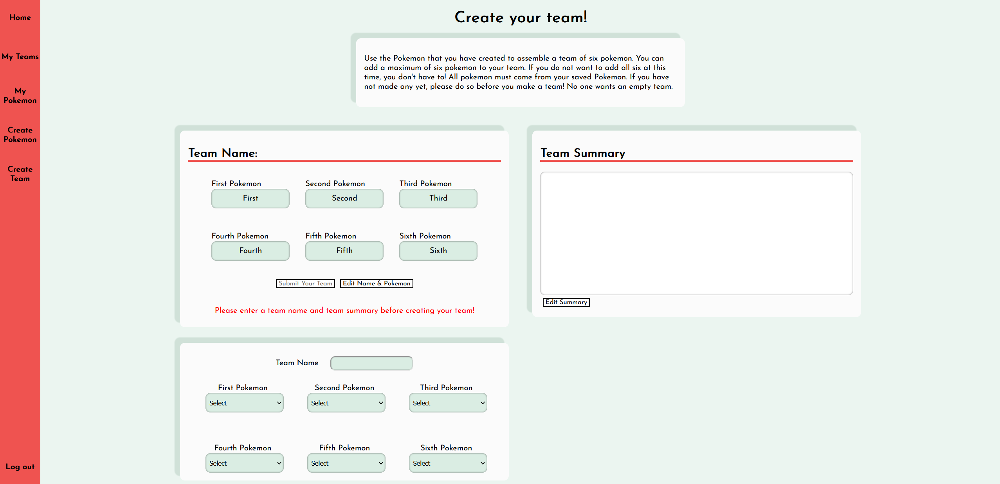

# Poke Meta

### Application is live at [Here](https://gyro-pokemon.onrender.com)

Poke Meta is an app designed to help a user create pokemon teams for competitive and casual use within all pokemon video games. Users can create and customize pokemon to the full extent and add them to teams to create interesting and unique combinations that dominate the pokemon leagues.

## Table of Contents

- [Installation](#installation)
- [Usage](#usage)

## Installation

To get started with JobSphere, follow these steps:

1. **Clone or fork the project.**
2. **Run 'pipenv install' in the root directory to install server dependecies.**
3. **Run 'npm install' to install frontend dependencies.**
4. **Run 'pipenv run flask db migrate' and 'pipenv run flask seed all' to add the mock data.**
5. **Run 'pipenv run flask run in the root depsoitory'.**
6. **Run 'npm start' in the react-app folder.**

## Usage

### My Pokemon

1. A logged in user can view their pokemon by navigating to "My Pokemon". They can edit or release (delete) pokemon from this page as well.

### My Teams

1. A logged in user can view their teams by navigating to "My Team". They can edit or delete teams from this page as well.

### Create Pokemon

1. A logged in user can search for any pokemon that exists in the pokemon universe (All 1000+ of them!).

2. A logged in user can then customize and save their copy of the pokemon for future use.

### Create Team

1. A logged in user can create pokemon teams using the pokemon that they have previously created. The user must use unique pokemon for each pokemon slot.

### A user can add comments to other users teams

1. A logged in user can create edit and delete comments they have made on other users pokemon teams.

